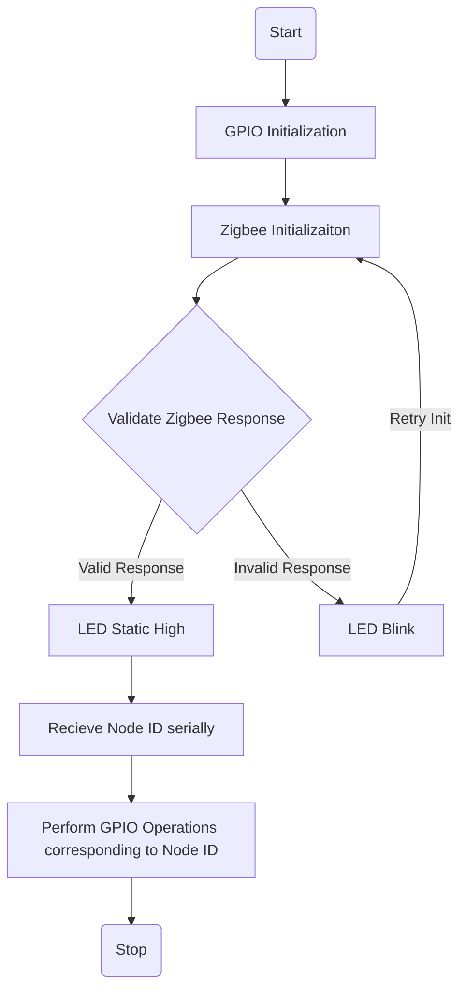

```mermaid
graph TD
A(Start) -->B[GPIO Initialization]
B --> C[Zigbee Initializaiton]
C --> Z{Validate Zigbee Response}
Z -->|Valid Response| D[LED Static High]
Z -->|Invalid Response| E[LED Blink]
E --> |Retry Init| C
D --> F[Recieve Node ID serially]
F --> G[Perform GPIO Operations corresponding to Node ID]
G --> H(Stop)
```